##### vs2022 从qt模板创建工程，选择初始模块，开发过程增加了模块，需要重新添加新增的模块，否则头文件中导入找不到


##### 查看已经配置的模块

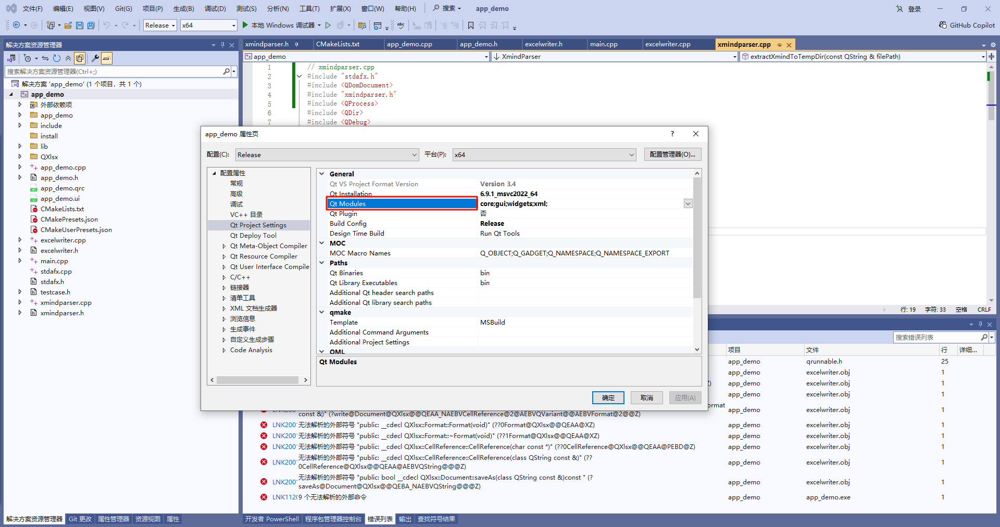

##### 打开模块选择页

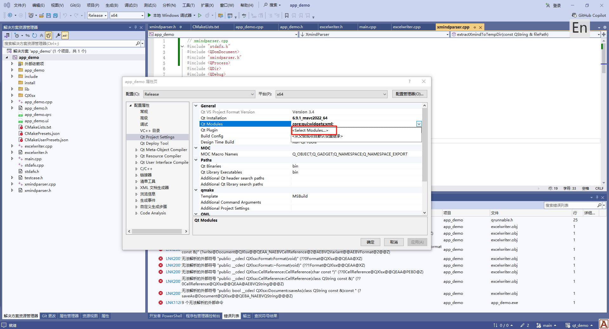

##### 增加新增的模块

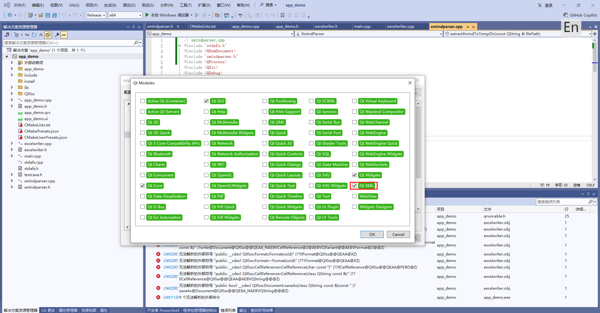

##### 配置qml调试

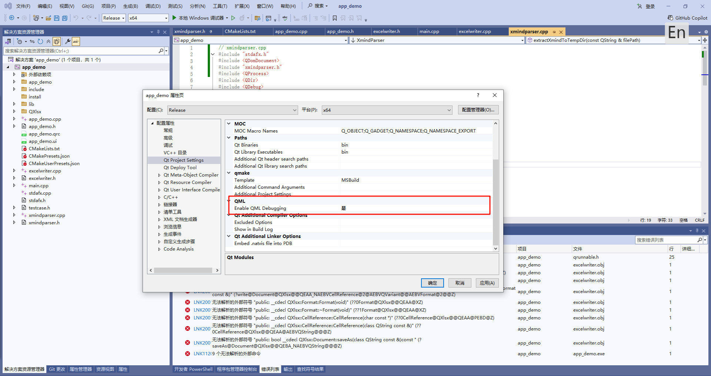

##### 库路径设置

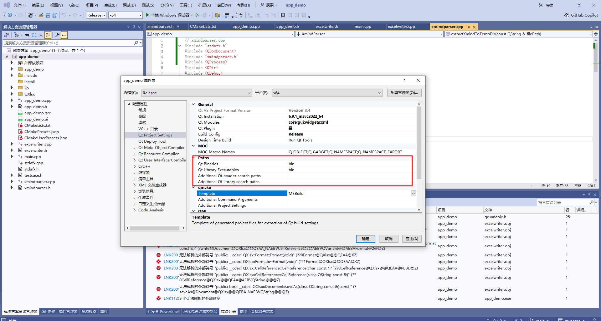

##### qt其他编译设置

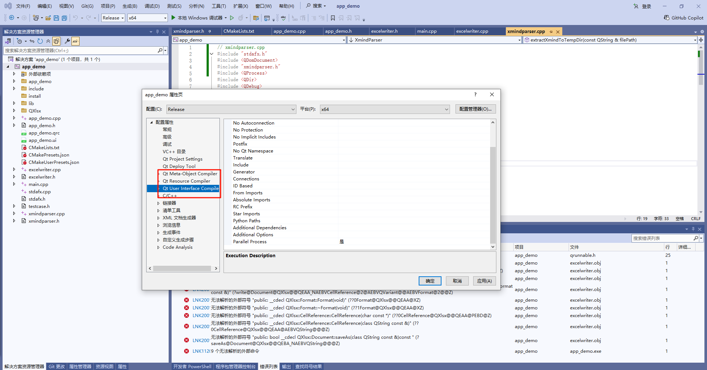

##### 使用cmake如果调用的是Visual Studio 2022 (MSVC v143) 工具链生成的就是vs的解决方案

```bash
cmake QXlsx/ -DCMAKE_INSTALL_PREFIX="D:/DemoWorkSpace/qt_demo/app_demo/QXlsx/install" -DCMAKE_BUILD_TYPE=Release
```

##### 后面cmake --build .编译的就是sln，截图显示编译的QXlsx.vcxproj，不加参数默认是debug

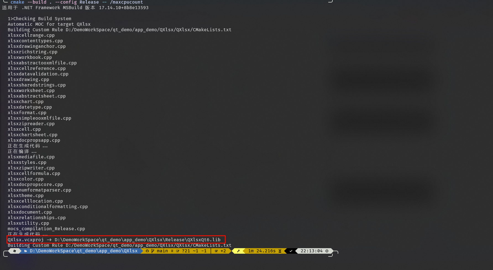

##### 指定编译配置

```bash
cmake --build . --config Release -- /maxcpucount
```

##### 指定编译器

```bash
cmake QXlsx/ \
  -G "MinGW Makefiles" \
  -DCMAKE_INSTALL_PREFIX="D:/DemoWorkSpace/qt_demo/app_demo/QXlsx/install" \
  -DCMAKE_BUILD_TYPE=Release
```

##### 未指定编译器时优先级

在 Windows 上，如果你没有通过 `-G` 显式指定生成器，**CMake 默认会优先选择 MSVC（Visual Studio）编译器**，而不是 MinGW。


##### CMake 的行为逻辑是这样的：

- 在 Windows 上，CMake 默认使用的构建工具链取决于：
  - 当前平台（Windows）
  - 是否检测到 Visual Studio 安装
  - 是否有多个可用的编译器路径在 `PATH` 中

##### ⚠️ **但 CMake 不是根据 `PATH` 来决定默认编译器的！**

它优先查找已安装的 Visual Studio 工具链（MSVC），因为这是 Windows 上最“原生”的开发环境。

##### 示例：不同情况下的默认行为

| 场景                                                         | 默认生成器              | 使用的编译器    |
| ------------------------------------------------------------ | ----------------------- | --------------- |
| 只有 MinGW-w64 在 PATH 中                                    | `MinGW Makefiles`       | g++             |
| 同时安装了 MinGW-w64 和 MSVC (VS)                            | `Visual Studio XX 20XX` | MSVC (`cl.exe`) |
| 没有 Visual Studio，但有 MinGW                               | `MinGW Makefiles`       | g++             |
| 指定了 `-G "MinGW Makefiles"`                                | 强制使用 MinGW          | g++             |
| 指定了 `-G "Ninja" -DCMAKE_C_COMPILER=gcc -DCMAKE_CXX_COMPILER=g++` | 使用 Ninja + GCC        | g++             |

##### 方法一：显式指定生成器

```bash
cmake -G "MinGW Makefiles" ..
```

##### 方法二：使用完整路径指定编译器（可选）

```bash
cmake .. -G "MinGW Makefiles" -DCMAKE_C_COMPILER="D:/mingw64/bin/gcc.exe" -DCMAKE_CXX_COMPILER="D:/mingw64/bin/g++.exe"
```

##### 方法三：使用 Ninja + MinGW

如果你想用更现代的构建系统（如 Ninja），也可以这样做：

```bash
cmake .. -G "Ninja" -DCMAKE_C_COMPILER="gcc" -DCMAKE_CXX_COMPILER="g++"
```

##### 如果你打开的文件夹下有CMakeList文件，Vs会自动识别生成sln

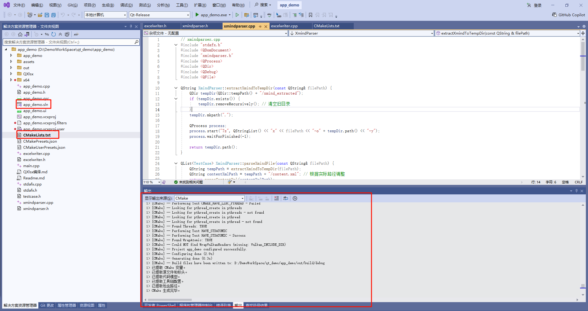

##### 打开生成sln就进入解决方案，再切换到输出窗口里才显示CMake，才能看到CMake输出

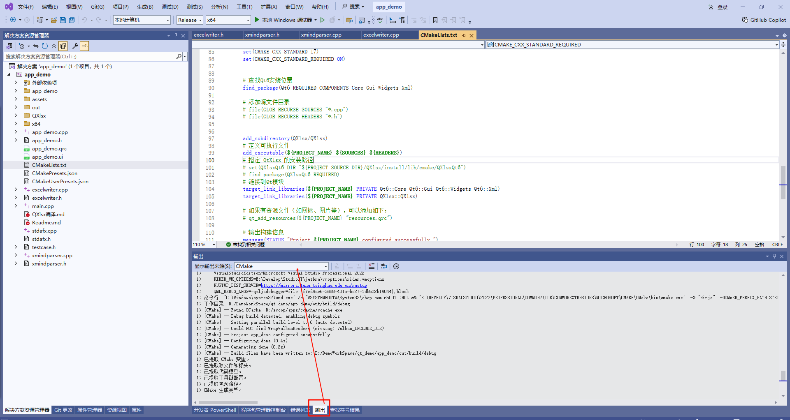

##### E2919命令行错误: 通过 --current_directory 选项指定的目录不是目录

我通过删除.vs目录、sln解决方案、工程目录解决了，后面只剩下CMakeList文件了，只能通过CMakeList启动项目了

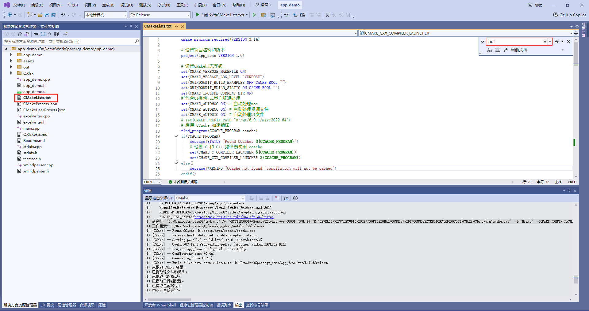

##### 按照顺序添加文件头和源文件，报错的原因是没有包含cpp文件导致的

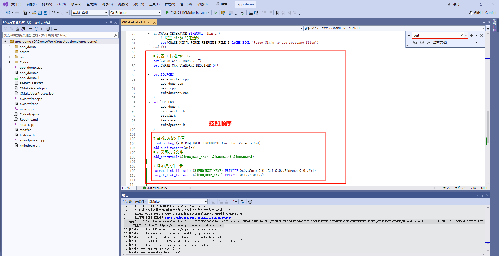

##### 要使用CMakeList启动程序就不要sln文件了，否则出现问题

